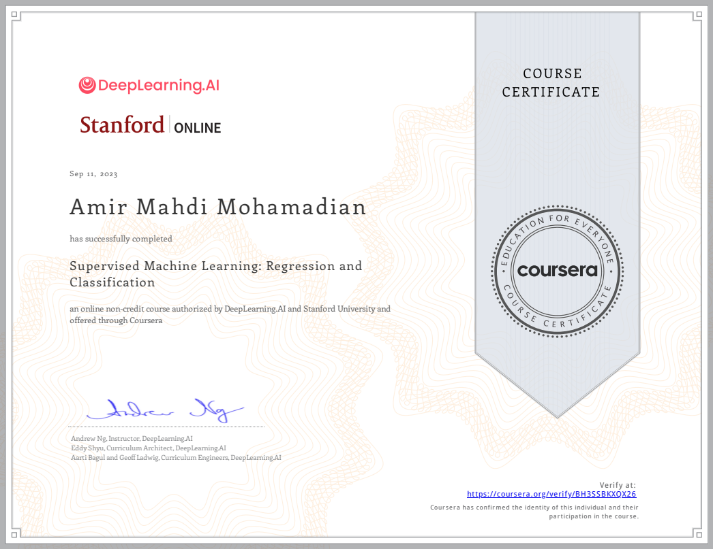
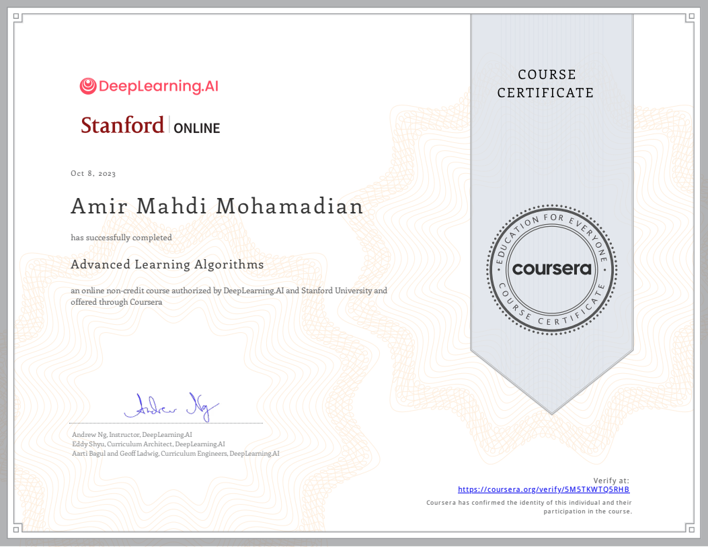

<h1 align="center">Hi there 👋, I'm Amir Mahdi</h1>
<h3 align="center">Senior Software Engineer · Graduate CS Student @ University of Tehran</h3>

  
  
  

---

## 👨‍💻 About Me

- 🎓 Graduate Computer Science student at the **University of Tehran**
- 💻 Passionate about building web applications, bringing my ideas into life!
- 🌐 Personal site: **https://amirmahdim79.github.io**
- 📫 Reach me at **amirmahdi.mohamadian79@gmail.com**

---

## 🔗 Connect With Me

 

---

## 🛠️ Tech Stack

### Languages

      

### Frontend

        

### Backend

    

### Databases & Search

    

### Data Science & ML

  

### DevOps & Tools

      

### Design

   

---

## 📊 GitHub Stats

  
  

  

---

## 🏆 Certifications

  

  
  

---

## 📸 Project Highlights

  
  
  
  
  

